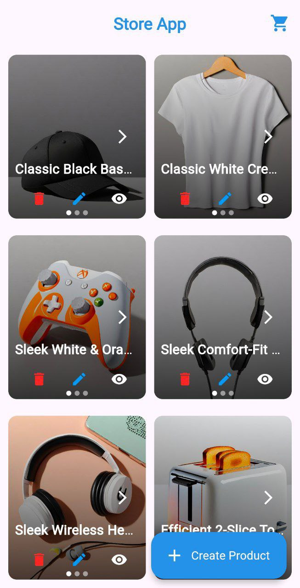
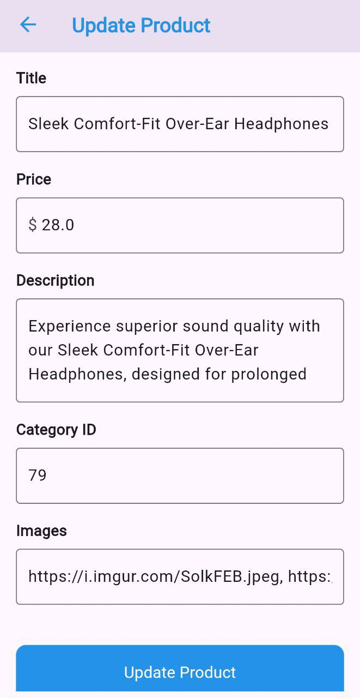
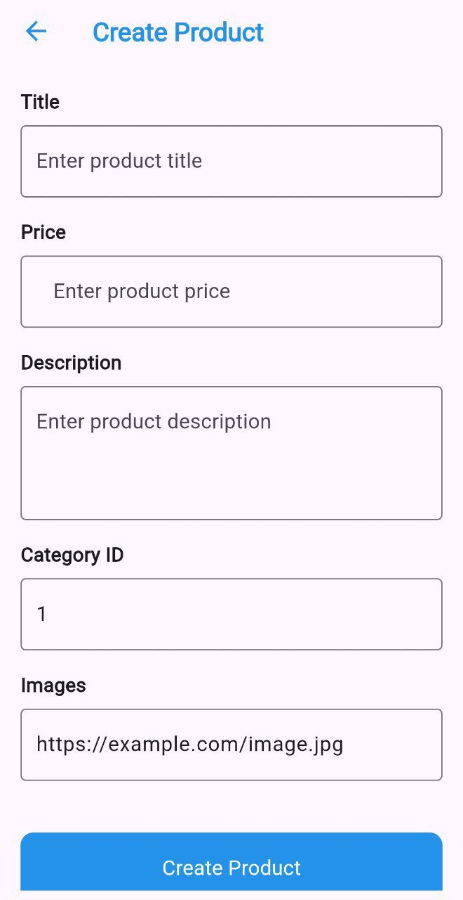

# 🛍️ Store App

A simple product management app built with Flutter and Bloc.

---

## 🚀 Features

- Display a list of products.
- Add new products.
- Edit and delete products.
- State management using Cubit/Bloc.
- Clean and smooth UI design.
- Currently uses a Fake API for demonstration purposes.

---

## 🧰 Technologies Used

- Flutter
- Bloc / Cubit
- Dio (for API handling)
- Git & GitHub

---

## 📱 Screenshots

  
*Home Screen showing all products*

  
*Edit product screen*

  
*Add new product screen*

  
*Product details screen*

---

## ⚙️ How to Run

1. Clone the repository:
```bash
   git clone https://github.com/saraQasouma/store_app.git
```
2. Navigate to the project directory:
```bash
   cd store_app
```
3. Get the dependencies:
```bash
   flutter pub get
```
4. Run the app:
```bash
   flutter run
```
---

## 👩🏻‍💻 Author

**Sara Qasouma**
